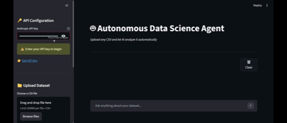

# 🤖 Autonomous Data Science Agent

An AI-powered data science agent that automatically analyzes any CSV dataset using **Claude AI + Machine Learning**. Upload a dataset, ask a question in plain English, and the agent decides which tools to use, runs the analysis, trains ML models, and delivers insights — all autonomously.

---

## 🎬 Demo



---

## 🧠 How It Works

This project is built on the **Model Context Protocol (MCP)** architecture:

```
User (Natural Language)
        ↓
  Streamlit Web UI
        ↓
  Claude AI (Brain)
        ↓
  MCP Tool Router
        ↓
┌───────────────────────────────────┐
│  describe_dataset                 │
│  run_python_analysis              │
│  generate_chart                   │
│  train_ml_model                   │
│  feature_importance               │
└───────────────────────────────────┘
```

Claude acts as the **reasoning engine** — it reads your question, decides which tools to call, chains them together intelligently, and explains the results in simple business terms.

---

## ✨ Features

- **Intelligent Tool Routing** — Claude only calls the tools needed for your question, not all of them
- **Statistical Analysis** — Correlations, distributions, and relationships between variables
- **Auto ML Training** — Trains a Random Forest model and returns R² score and error metrics
- **Feature Importance** — Ranks which variables drive your target metric the most
- **Chart Generation** — Scatter plots, bar charts, and correlation heatmaps on demand
- **Session Isolation** — Each session uses its own data, no cross-session chart mixing
- **Rate Limit Handling** — Friendly messages instead of raw error traces
- **API Key Input** — Paste your Anthropic key directly in the UI, no `.env` needed

---

## 🛠️ Tech Stack

| Layer | Technology |
|-------|-----------|
| AI Brain | Claude (Anthropic) |
| Agent Protocol | MCP (Model Context Protocol) |
| ML Engine | Scikit-learn (Random Forest) |
| Data Processing | Pandas, NumPy |
| Visualization | Matplotlib, Seaborn |
| Web UI | Streamlit |
| Language | Python |

---

## 📁 Project Structure

```
data-science-agent/
├── app.py                  # Streamlit web UI + agentic loop
├── requirements.txt        # Python dependencies
├── .env                    # Your API key (not committed)
├── .gitignore
├── demo.gif                # Demo recording
├── mcp_server/
│   └── server.py           # MCP server with all 5 tools
├── uploads/                # Uploaded CSV files (not committed)
└── outputs/                # Generated charts (not committed)
```

---

## 🚀 Getting Started

### 1. Clone the repo
```bash
git clone https://github.com/yourusername/data-science-agent.git
cd data-science-agent
```

### 2. Create and activate virtual environment
```bash
python -m venv venv

# Windows
venv\Scripts\activate

# Mac/Linux
source venv/bin/activate
```

### 3. Install dependencies
```bash
pip install -r requirements.txt
```

### 4. Get your Anthropic API key
👉 https://console.anthropic.com → API Keys → Create Key

### 5. Run the app
```bash
streamlit run app.py
```

### 6. Open in browser
```
http://localhost:8501
```

Paste your Anthropic API key in the sidebar, upload any CSV, and start asking questions!

---

## 💬 Example Questions

| Question | Tools Used |
|----------|-----------|
| `What columns are in this dataset?` | `describe_dataset` |
| `What drives revenue the most?` | `run_python_analysis` |
| `Show me a correlation heatmap` | `generate_chart` |
| `Train a model to predict revenue` | `train_ml_model` |
| `Which features matter most?` | `feature_importance` |
| `Give me a full analysis` | All tools |

---

## 🔧 MCP Tools

### `describe_dataset`
Inspects the CSV and returns shape, column names, data types, missing values, and sample rows.

### `run_python_analysis`
Computes correlations between all numeric columns and the target variable. Labels each as strong/moderate/weak positive or negative.

### `generate_chart`
Generates scatter plots, bar charts, or correlation heatmaps. Returns base64-encoded image — no disk dependency.

### `train_ml_model`
Trains a Random Forest Regressor with an 80/20 train-test split. Returns R² score, MAE, and model quality rating.

### `feature_importance`
Uses Random Forest feature importances to rank which variables drive the target metric. Labels each as High / Medium / Low impact.

---

## 📊 Sample Dataset

A sample dataset is included to test the agent:

```
month, marketing_spend, store_count, avg_price, revenue
Jan, 5000, 10, 25.5, 32000
...
```

Try asking: `Give me a full analysis` with `revenue` as the target.

---

## 🔑 Environment Variables

Create a `.env` file in the root folder (optional — you can also paste the key in the UI):

```
ANTHROPIC_API_KEY=sk-ant-your-key-here
```

---

## 📄 License

MIT License — feel free to use, modify, and share.

---

## 🙋 Author

Built by **Kunal** — connecting LLMs with ML automation to build intelligent data tools.

[](https://linkedin.com/in/yourprofile)
[](https://github.com/yourusername)
